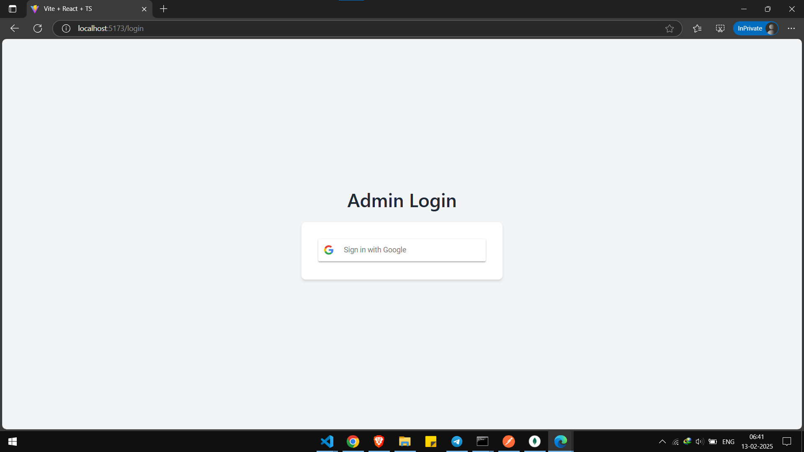

# WEATHER BOT

#### This is a backend project which can be used to subscribe for getting daily update on weather

## Table of Contents

- [Project Features](#project-features)
- [Tech Stack](#tech-stack)
- [Libraries Used](#libraries-used)
- [Setup and Installation](#setup-and-installation)
- [Environment Variables](#environment-variables)
- [API Endpoints and Sample Requests](#api-endpoints-and-sample-requests)
- [Development Choices](#development-choices)
- [Deployment](#deployment)
- [Acknowledgements](#acknowledgements)
- [Answers for the Assignment](#answers-for-the-assignment)

---

## Project Features

- **Authentication**: Implement secure user authentication using JWT
- **Dashboard**: Dashboard to remove user and update bot api
- **Weather updates**: Send weather updates via telegram

---

## Images

Login



Dashboard


## Tech Stack

- **Backend**: NodeJs, Express, Typescript
- **Database**: MongDB, Redis
- **Frontend**: React, Typescript

---

## Libraries Used

- **dotenv**: Loads environment variables from `.env` file.
- **express**: Fast, minimal web server framework.
- **nodemon**: Automatically restarts server on file changes..
- **typescript**: Used to write TypeScript code.
- **ts-node**: Execute typescript code.
- **jsonwebtoken**: Implement authentication and role based access control

---

## Setup and Installation

### Prerequisites

- NodeJS
- MongoDB
- Redis

### Environment Variables

- Create `.env` filesas per `.env.example` in schedular-service, watcher-service

### Steps

1. **Clone the Repository**:
   ```bash
   git clone https://github.com/ayushjaiz/weather-bot
   cd job-schedular
   ```
2. **Run the backend:**
   ```bash
   cd backend
   npm install
   npm run start
   ```
3. **Run the frontend:**
   ```bash
   cd client
   npm install
   npm run dev
   ```

---

## Routes

### Public Routes

| Route       | Method | Description   |
| ----------- | ------ | ------------- |
| /auth/login | POST   | Login via use |

### Protected Routes

- Admin Routes

| Route                  | Method | Description          |
| ---------------------- | ------ | -------------------- |
| /admin/subscribers/:id | DELETE | emove subscriber     |
| /admin/subscribers     | GET    | View all subscribers |

## Development Choices

### Why Node.js?

- Excellent package ecosystem
- Strong async/await support
- Easy deployment options

### Why Typescript?

- Prevent from errors during development phase
- Type security
- Faster code development

### Why MongoDB?

- Flexibility to accomodate changes in schema
- Easy documentation
- Support for agenda to poll to read db every minute

---

## Deployment

Backend: https://weather-bot-ld9o.onrender.com

Please start backend by hitting route first before accesiing other live links

Bot link: t.me/weather_updates_2025_bot
Frontend: https://weather-bot-rho.vercel.app/


---

## Acknowledgements

This project was completed with the assistance of various online resources. I utilized the following tools and sources to support the development of this application:

- Google + Stack Overflow - for bugs and documentation of libraries
- MongoDb docs

## Answers for the Assignment

### Three things that I learned from this assignment

- Code modularity. This repo features code division into routes, controllers and database layer.

### What was the challenging part of the assignment?

- Designing the system overall architecture
